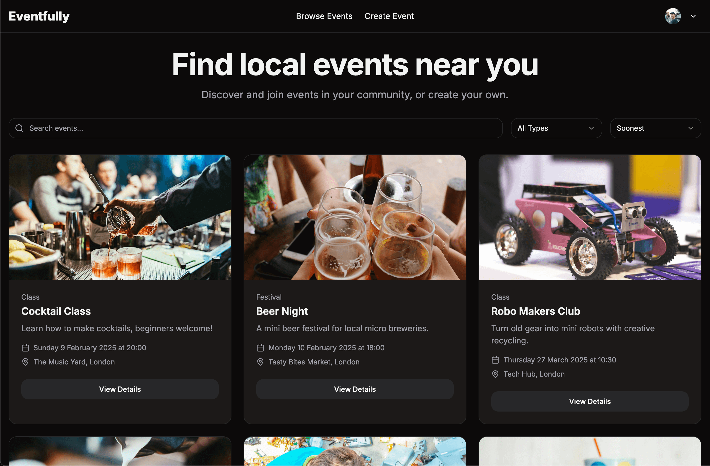

<div align="center">
  <h1>Eventfully</h1>
  <p>A modern local event management platform built with Next.js and Supabase.</p>
  <p>Users can quickly sign up and book event tickets, or create their own events to share with others using their own organiser profile.</p>
  
</div>

#

<div align="center">
  <a href="#features">Features</a> •
  <a href="#tech-stack">Tech Stack</a> •
  <a href="#getting-started">Getting Started</a> •
  <a href="#deployment">Deployment</a> •
  <a href="#testing">Testing</a>
</div>

## Live Demo

- Visit the live demo site: [Eventfully](https://eventfully-app.vercel.app/)

## Features

🎫 **Event Management**
- Create and manage detailed events with images, event types, locations and more
- Upload event images easily with UploadThing integration.
- Set event ticket capacity (event pricing tiers to come).
- Update event data or cancel events easily in your dashboard.

👤 **User Roles**
- Public viewing of events without authentication needed.
- User registration and authentication with Supabase
- Organiser profiles are available to all users but tied to the user's account for safety and security.
- Organisers can track all upcoming and also past events they have created.

📅 **Calendar Integration**
- Add events to Google Calendar, more integrations to come.
- Automatic timezone handling with `add-to-calendar-button-react`.
- add-to-calendar-button-react is a package that allows you to add events to your calendar easily. Multiple calendars supported though only Google Calendar is currently fully tested and working.
- Each user a 'my events' page to view all their bookings with calendar integration buttons.

🎨 **Modern UI/UX**
- Responsive design for all devices.
- Light and Dark mode support.
- Event search and filtering functionality.
- Using shadcn/ui for components for easy customization by clients.
- Accessible components with ARIA labels.
- Loading states and error handling on forms and throughout the app.

## Tech Stack

### Core
- [Next.js 15](https://nextjs.org/) - React framework with App Router and Server Actions
- [TypeScript](https://www.typescriptlang.org/) - Type safety
- [Supabase](https://supabase.com/) - Backend SQL database and Authentication
- [TailwindCSS](https://tailwindcss.com/) - Styling
- [shadcn/ui](https://ui.shadcn.com/) - UI Components
- [Vercel](https://vercel.com/) - Deployment
- [UploadThing](https://uploadthing.com/) - Media File Uploads and Storage

### Key Packages

📦 **Core Dependencies**
- `@supabase/ssr` - Supabase Server-Side Rendering utilities
- `@supabase/supabase-js` - Supabase JavaScript client
- `@uploadthing/react` - File upload integration
- `next-themes` - Dark mode support
- `sonner` - Toast notifications
- `add-to-calendar-button-react` - Calendar integration

🎨 **UI and Styling**
- `@radix-ui/react-*` - Headless UI components
- `class-variance-authority` - Dynamic class composition
- `tailwind-merge` - Smart class merging
- `lucide-react` - Icon library
- `tailwindcss-animate` - Animation utilities

## Getting Started

### Test Account Credentials

**User & Organiser login:**  
Email: joe@example.com  
Password: abc123

With this account you can view all events and book tickets, or create your own events and manage them in your dashboard.

Joe is an organiser and and has created multiple events plus booked himself onto some events as a user.
You can see Joes events on the my-events page and you can also checkout his organiser profile settings page.

Please note that currently all events are set to 'free' though Stripe integration is coming soon.

No email verification is currently implemented so you can use the details above to sign in. Password recovery is also not available because of using the example.com domain.

### Local Development Setup

1. Clone the repository:
  ```bash
  git clone https://github.com/sidendev/eventfully.git
  cd eventfully
  ```

2. Install dependencies:
  ```bash
  npm install
  ```

3. Set up your environment variables:
  ```bash
  cp .env.example .env
  ```

4. Update `.env.local` with your credentials:  
  ```bash
  NEXT_PUBLIC_SUPABASE_URL=your_supabase_url
  NEXT_PUBLIC_SUPABASE_ANON_KEY=your_supabase_anon_key
  UPLOADTHING_SECRET=your_uploadthing_secret
  UPLOADTHING_APP_ID=your_uploadthing_app_id
  ```

### Database Setup

1. Create a new Supabase project at [supabase.com](https://supabase.com)

2. Open the SQL editor panel on your Supabase project.

3. Copy the contents of database/schema.sql into your Supabase SQL editor.

4. Enable Row Level Security (RLS) policies as defined in the schema if they have not already been enabled.

## Customization

### Styling with shadcn/ui

#### Theme Customization
The reason for using shadcn/ui is to have a consistent theme across the app. I also like the ease of customizing the theme with the shadcn/ui theme editor so that clients can change the theme to match their brand.

You can easily change the theme to have different colors and border radius which alters the look of the app a lot.

You can modify the theme in `app/globals.css`:
```css
@layer base {
  :root {
    --background: 0 0% 100%;
    --foreground: 240 10% 3.9%;
    /* ... other variables ... */
  }
}
```

#### Changing Fonts

The app uses the Inter font but you can change it to any other font you want very easily.

1. Import your preferred font from `next/font/google` in `app/layout.tsx`:
```typescript
import { Inter, Roboto, Open_Sans } from 'next/font/google';

// Example with Inter font
const inter = Inter({ subsets: ['latin'] });

// Or use a different font
const roboto = Roboto({
  weight: ['400', '500', '700'],
  subsets: ['latin'],
});
```

2. Apply the font to your application:
```typescript
export default function RootLayout({
  children,
}: {
  children: React.ReactNode;
}) {
  return (
    <html lang="en">
      <body className={inter.className}>{children}</body>
    </html>
  );
}
```

3. For local fonts, place them in the `public/fonts` directory and use `next/font/local`.

## Testing

The app is fully responsive and has been tested on a range of devices.

Colour contrast has been checked and is compliant.

ARIA labels are used throughout the app to improve accessibility, currently the app in deployment gets a warning for the dropdown menus on creating events and editing events. This is an issue with the hidden dropdown menu component, I am working on a fix for this.

Next js server actions are used for the forms and they are protected by supabase auth. I plan to add further testing on the server actions in the future.

Screen readers have been tested through the app and the forms are accessible using keyboard navigation.

Sonner toast notifications have been tested and are working as expected giving feedback to the user where needed and errors are displayed.

## Deployment with Vercel

1. Push your code to GitHub on the main branch.
2. Set up a new project on Vercel.
3. Connect your GitHub repository to Vercel in the Vercel dashboard.
4. Add your supabase and uploadthing environment variables in Vercel dashboard.
5. Deploy with Vercel.

## Media Sources and Credits

- UI Components: [shadcn/ui](https://ui.shadcn.com)
- Icons: [Lucide Icons](https://lucide.dev)
- Website Images: [Unsplash](https://unsplash.com)
- Favicon Logo: [Canva](https://canva.com)

## Future Roadmap

🚀 **Planned Features**  

There are a number of features that I plan to add to the app in the future.
The SQL database is already set up for these features so they are ready to be added.

1. **Enhanced Event Management**
   - Multiple ticket tiers
   - Event series management for recurring events

2. **Payment Integration**
   - Stripe payment processing
   - Refund handling
   - Payment analytics

3. **Social Features**
   - Event sharing on social media
   - Organiser networking, allowing other users to organise same events
   - Event ratings
   - Social media account login (Google, Twitter, Facebook, etc.)

4. **Advanced Organiser Analytics**
   - Attendance tracking
   - Revenue reporting

5. **Mobile Experience**
   - Mobile app version with Expo / React Native
   - Push notifications
   - QR code check-in

6. **Email Integration**
   - Send email notifications to attendees
   - QR code tickets via email

<!-- ## License -->

